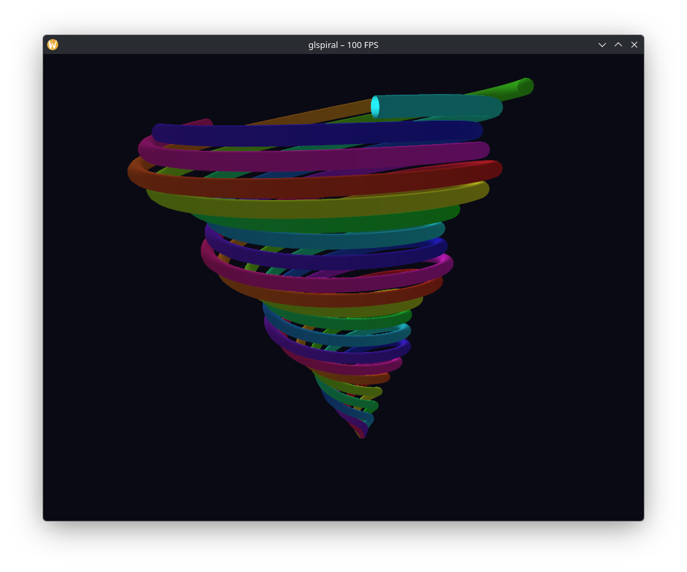

# glspiral

> A visually rich OpenGL benchmark demo — a spiritual successor to `glxgears`.

[](https://github.com/user14923929/glspiral/actions/workflows/ci.yml)

Instead of rotating gears, **glspiral** renders **five intertwined 3D spirals** built as tube meshes with per-vertex HSV colour gradients, Phong-style diffuse lighting, an animated light source, pulse animation, and interactive mouse rotation.  It reports live FPS in the window title — just like `glxgears`, but prettier.



---

## Features

| Feature | Details |
|---|---|
| 5 spiral arms | Each arm is a full helical tube mesh |
| HSV colour gradient | Colours shift smoothly along each arm and over time |
| Phong diffuse lighting | Per-vertex normal + animated rotating light |
| Pulse animation | Arms breathe in and out independently |
| Camera drag | Left-click + drag to orbit the scene |
| Live FPS counter | Displayed in the window title bar |
| MSAA 4× | Multi-sample anti-aliasing via GLFW hint |

---

## Requirements

| Tool / Library | Version |
|---|---|
| C++ compiler | C++17 (GCC ≥ 9 / Clang ≥ 9) |
| CMake | ≥ 3.16 |
| OpenGL | ≥ 3.3 core |
| GLFW3 | ≥ 3.3 |
| GLEW | ≥ 2.0 |

### Install dependencies

**Arch / CachyOS / Manjaro**
```bash
sudo pacman -S cmake glfw glew
```

**Ubuntu / Debian**
```bash
sudo apt install cmake libglfw3-dev libglew-dev libgl1-mesa-dev
```

**Fedora**
```bash
sudo dnf install cmake glfw-devel glew-devel mesa-libGL-devel
```

---

## Build

```bash
git clone https://github.com/YOUR_USERNAME/glspiral.git
cd glspiral
cmake -B build -DCMAKE_BUILD_TYPE=Release
cmake --build build -j$(nproc)
```

Run:
```bash
./build/glspiral
```

### Install system-wide (optional)
```bash
sudo cmake --install build
```

---

## Controls

| Input | Action |
|---|---|
| Left mouse drag | Orbit camera |
| `Esc` | Quit |

---

## Project structure

```
glspiral/
├── CMakeLists.txt
├── LICENSE
├── README.md
└── src/
    └── main.cpp      # all geometry, shaders, render loop
```

Everything is intentionally contained in a single translation unit for simplicity and easy hacking.

---

## How it works

### Geometry

Each spiral arm is generated as a **tube mesh** around a helical spine:

1. **Spine** — `TURNS_PER_ARM × STEPS_PER_TURN` sample points computed by `(r·cos θ, y, r·sin θ)` where `r` and `y` both grow linearly along the arm.
2. **Frenet frame** — at each spine sample, a local `{Tangent, Binormal, Normal}` frame is constructed from forward-differences.
3. **Tube ring** — `TUBE_SEGMENTS` vertices are placed around the spine using the Binormal and Normal vectors.
4. **Quads** — adjacent rings are stitched with two triangles per quad.

### Shaders

Plain GLSL 3.30 core:
- Vertex shader: transforms positions with a MVP matrix and applies diffuse lighting in world space.
- Fragment shader: outputs the lit colour.  No textures needed.

### Animation

Every frame:
- Geometry is **rebuilt on the CPU** with the current `time` value, which drives colour hue cycling and the pulse factor.
- The model matrix adds slow automatic Y-rotation plus a gentle Z-sway.
- The light direction orbits in the XZ plane over time.

---

## Tweakable constants

Edit the top of `src/main.cpp`:

```cpp
static const int   SPIRAL_ARMS     = 5;    // number of arms
static const int   TURNS_PER_ARM   = 4;    // helical turns per arm
static const int   STEPS_PER_TURN  = 80;   // spine resolution
static const float TUBE_RADIUS     = 0.035f;
static const int   TUBE_SEGMENTS   = 12;   // tube cross-section facets
```

---

## License

**GNU General Public License v3.0** — see [LICENSE](LICENSE).
